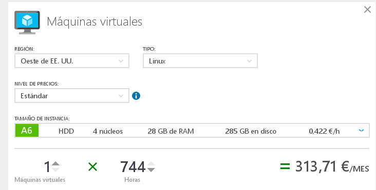
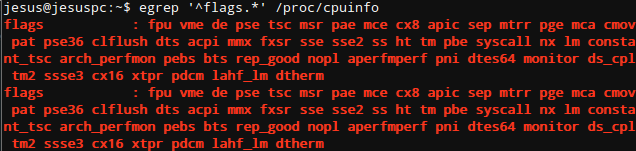
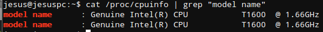
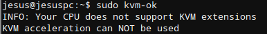

# Tema 1

### Ejercicio 1: Consultar en el catálogo de alguna tienda de informática el precio de un ordenador tipo servidor y calcular su coste de amortización a cuatro y siete años.

Mirando por Amazon he encontrado el servidor [HP 726042-425](http://www.amazon.es/dp/B00E88ZHLC/ref=asc_df_B00E88ZHLC29121151/?tag=googshopes-21&creative=24526&creativeASIN=B00E88ZHLC&linkCode=df0)

Su precio es de 682,51€ (IVA incl.), como necesitamos el precio sin IVA pues hacemos el cálculo:

682.51€ / 1.21 = 564.05€

**Amortización a 4 años**

Con una amortización máxima del 25% por año: 

    - Primer año: 	564.05€ * 0.25 = 141.01€
    - Segundo año:	564.05€ * 0.25 = 141.01€
    - Tercer año:	564.05€ * 0.25 = 141.01€
    - Cuarto año:	564.05€ * 0.25 = 141.01€

**Amortización a 7 años**

En este caso se va reduciendo el coste del producto conforme pasan los años, los 2 primeros años se mantiene el 25% pero el 50% restante se divide de forma gradual en los 5 siguientes años como podemos ver a continuación:

    - Primer año: 	564.05€ * 0.25 = 141.01€
    - Segundo año:	564.05€ * 0.25 = 141.01€
    - Tercer año:	564.05€ * 0.15 =  84.60€
    - Cuarto año:	564.05€ * 0.15 =  84.60€
    - Quinto año:	564.05€ * 0.10 =  56.40€
    - Sexto año:	564.05€ * 0.05 =  28.20€
    - Séptimo año:  564.05€ * 0.05 =  28.20€

### Ejercicio 2: Usando las tablas de precios de servicios de alojamiento en Internet y de proveedores de servicios en la nube, comparar el coste durante un año de un ordenador con un procesador estándar (escogerlo de forma que sea el mismo tipo de procesador en los dos vendedores) y con el resto de las características similares (tamaño de disco duro equivalente a transferencia de disco duro) en el caso de que la infraestructura comprada se usa sólo el 1% o el 10% del tiempo.

Para el servidor dedicado he optado por [OVH](https://www.ovh.es)

Para cloud he optado por [Azure](https://azure.microsoft.com)

#### Uso de un 1% del tiempo:

Un 1% de un mes es apróximadamente 30 días x 0.01 = 0.3 días, por tanto si el día sale a 313.71€ / 30 = 10.457€/día, tenemos que el mes nos saldría apróximadamente a 10.457€ x 0.03 = 3.1371€/mes, frente a los 59.99€+IVA/mes del servidor dedicado.

#### Uso de un 10% del tiempo:

En este caso un 10% de un mes es apróximadamente 30 días x 0.1 = 3 días, por tanto si el día sale a 313.71€ / 30 = 10.457€/día, tenemos que el mes nos saldría apróximadamente a 10.457€ x 3 = 31.371€/mes, frente a los 59.99€+IVA/mes del servidor dedicado.

#### Extra: a partir de que punto nos saldría igual o más caro el cloud:

59.99€+IVA = 72.5879€, por tanto 72.5879 / 10.457 = 6.94 días.

A partir de un uso de 166 horas, 35 minutos y 24 segundos nuestra solución cloud comenzaría a costarnos más cara que la del servidor dedicado. No obstante las características de ambas no son exactamente iguales ni se ha detallado el tipo de problema a abarcar por tanto no debemos guiarnos exclusivamente por este criterio.

### Ejercicio 3.2: Crear un programa simple en cualquier lenguaje interpretado para Linux, empaquetarlo con CDE y probarlo en diferentes distribuciones.

Descargo "cde" de [aqui](https://cloud.github.com/downloads/pgbovine/CDE/cde_2011-08-15_64bit) y a cotinuación:

    sudo mv cde_2011-08-15_64bit /usr/bin/cde
    sudo chmod u+x /usr/bin/cde

Creo un script sencillo en Ruby:

    #!/usr/bin/ruby
    $i = 0
    $num = 5
    while $i < $num  do
       puts("i = #$i" )
       $i +=1
    end

Empaquetemos con la orden:

    cde ruby script1.rb

Como vemos CDE nos permite empaquetar un determinado software con sus dependencias para ejecutarlo sin problemas en otra distribución Linux sin preocuparnos de preparar tanto el entorno.

### Ejercicio 4: Comprobar si el procesador o procesadores instalados tienen estos flags. ¿Qué modelo de procesador es? ¿Qué aparece como salida de esa orden?

Los flags que me aparecen son los siguientes:

    egrep '^flags.*' /proc/cpuinfo

Vemos que no tengo los flags de virtualización, pudiera ser que no estén activados por defecto también.

Para ver el modelo de procesador usamos:

    cat /proc/cpuinfo | grep "model name"

La orden cat /proc/cpuinfo sin el grep, nos da toda la información detallada del ordenador pero con el filtro grep obtenemos solo el nombre del procesador. Como vemos tengo 2 núcleos de Intel T1600 a 1.66GHz

### Ejercicio 5.1: Comprobar si el núcleo instalado en tu ordenador contiene este módulo del kernel usando la orden kvm-ok.

    sudo kvm-ok

### Ejercicio 5.2: Instalar un hipervisor para gestionar máquinas virtuales, que más adelante se podrá usar en pruebas y ejercicios.

La verdad es que siempre he usado [VirtualBox](https://www.virtualbox.org/), aunque investigando un poco vemos que existen dos tipos de hipervisores:

*Un hipervisor es un monitor de máquinas virtuales que permite instalarlas, activarlas, monitorizar su actividad e interaccionar con ellas de las formas posibles. Un hipervisor se denomina bare-metal o Tipo uno si se ejecuta antes que el sistema operativo (siendo, por tanto, un sistema operativo en sí) o Tipo 2 si se arranca como una aplicación del sistema operativo; VirtualBox sería un ejemplo de este último.* [JJ-Teoría](http://jj.github.io/IV/documentos/temas/Contenedores#breve-introduccin-a-los-hipervisores)

*Algunos de los hipervisores tipo 1 más conocidos son los siguientes: VMware ESXi Free (gratis), VMware ESX (de pago), Xen (libre), Citrix XenServer (gratis), Microsoft Hyper-V Server (gratis).*[Wikipedia-Hipervisor](https://es.wikipedia.org/wiki/Hipervisor)

*Algunos de los hipervisores tipo 2 más utilizados son los siguientes: Oracle: VirtualBox (gratis), VirtualBox OSE (desde la v4.0 fusionado en VirtualBox), VMware: Workstation (de pago), Server (gratis), Player (gratis), QEMU (libre), Microsoft: Virtual PC, Virtual Server, Oracle VM (gratis).* [Wikipedia-Hipervisor](https://es.wikipedia.org/wiki/Hipervisor)
